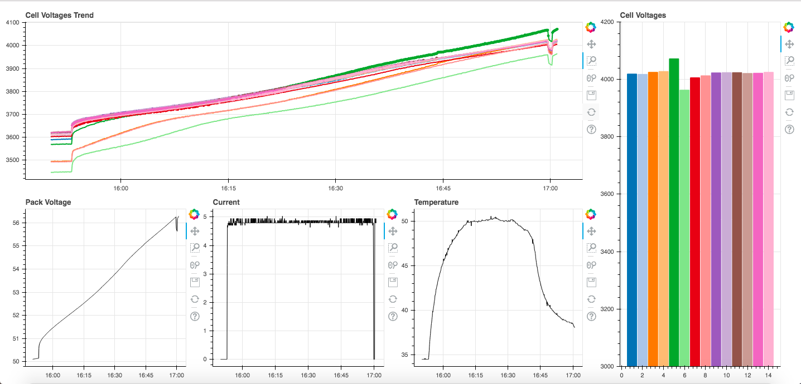

# Tiny BMS Monitor App

This repo contains a web-based monitor for battery charging.
It is configured to read from the Energus Tiny BMS.

Balancing is indicated on the voltage trend graph by dots.
The sample time is currently set to five seconds.

This is coded in Python using the Bokeh library for graphing.
It also uses the PyModbus library to make calls to the BMS microcontroller.

## References

- [Tiny BMS Manual]()
- [Tiny BMS Communication Specification]()
